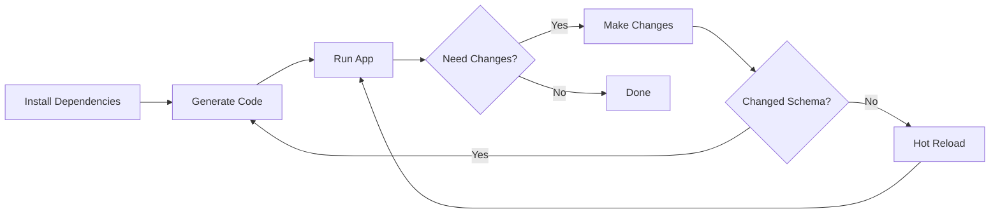

# Noor AI - Quick Start Guide

Get Noor AI running in 5 minutes.

## Prerequisites

- ✅ Flutter 3.38+ installed
- ✅ Dart 3.10+ installed
- ✅ IDE (VS Code or Android Studio)
- ✅ iOS Simulator or Android Emulator

Check your Flutter:
```bash
flutter doctor
```

## Installation (3 Steps)

### 1. Install Dependencies

```bash
flutter pub get
```

### 2. Generate Code

```bash
dart run build_runner build --delete-conflicting-outputs
```

Note: This will fail initially because the database schema is not complete. That's expected.

### 3. Run the App

```bash
flutter run
```

The app will launch with placeholder screens for all features.

## What You'll See

The app includes:

- 🏠 **Home Screen**: Dashboard with quick actions and progress tracking
- 📖 **Quran**: Placeholder for Quran reader
- 🤖 **Noor AI**: Placeholder for AI chat
- 🔤 **Learn Arabic**: Placeholder for Arabic learning
- ⏰ **Prayer**: Placeholder for prayer times

All screens are functional but show "Coming Soon" placeholders.

## Next Steps

### Option 1: Follow Development Guide

See `DEVELOPMENT.md` for step-by-step implementation instructions.

### Option 2: Use Implementation Prompts

Copy the session prompts from your implementation guide and paste them into Claude Code CLI.

Start with:
- **Session 2**: Database Schema Implementation
- **Session 4**: Quran Reader Implementation
- **Session 5**: Prayer Times Feature

### Option 3: Explore the Codebase

Key files to explore:
- `lib/main.dart` - App entry point
- `lib/app/app.dart` - Material App setup
- `lib/app/router.dart` - Navigation routes
- `lib/app/theme/app_theme.dart` - Material 3 theme
- `lib/features/*/presentation/screens/*.dart` - Feature screens

## Common First-Time Issues

### ❌ "No Connected Devices"

Start an emulator:
```bash
# List available emulators
flutter emulators

# Launch an emulator
flutter emulators --launch <emulator_id>

# Or use your IDE's device manager
```

### ❌ Build Runner Fails

This is expected because the database schema is incomplete. Continue with Phase 2 (Database Implementation).

### ❌ Missing Dependencies

```bash
flutter clean
flutter pub get
```

### ❌ Font Warnings

Fonts are not included in the repo. Download them separately:
- Poppins: https://fonts.google.com/specimen/Poppins
- Amiri: https://fonts.google.com/specimen/Amiri
- KFGQPC: https://fonts.qurancomplex.gov.sa/

Place in `assets/fonts/` directory.

## Project Structure Overview

```
noor-ai/
├── lib/
│   ├── main.dart              # Entry point
│   ├── app/                   # App-level configuration
│   │   ├── app.dart          # MaterialApp
│   │   ├── router.dart       # GoRouter routes
│   │   └── theme/            # Material 3 theme
│   ├── features/             # Feature modules
│   │   ├── quran/           # Quran reading
│   │   ├── arabic_learning/ # Arabic learning
│   │   ├── noor_ai/         # AI chat
│   │   ├── prayer/          # Prayer times
│   │   └── home/            # Home dashboard
│   └── shared/              # Shared code
│       ├── data/            # Database, storage
│       ├── providers/       # Riverpod providers
│       └── widgets/         # Reusable widgets
├── assets/                   # Assets (fonts, images, data)
├── test/                     # Unit tests
├── integration_test/         # Integration tests
└── docs/                     # Documentation
    └── MASTER-PRD.md        # Complete product spec
```

## Development Workflow



## Hot Reload

While the app is running:
- Press `r` to hot reload
- Press `R` to hot restart
- Press `p` to see performance overlay
- Press `q` to quit

## API Keys (Optional for now)

Copy `.env.example` to `.env` and add keys when ready:
- OpenAI API: For photo-to-Quran recognition
- Sunnah.com API: For hadith data

Not required for initial development.

## Firebase Setup (Optional for now)

Firebase is optional for local development. You can skip this until deploying.

When ready:
1. Create Firebase project
2. Download config files
3. Place in `android/app/` and `ios/Runner/`

## Testing

```bash
# Run all tests
flutter test

# Run specific test
flutter test test/features/quran/quran_test.dart
```

## Getting Help

- 📚 See `DEVELOPMENT.md` for detailed development guide
- 📋 See `docs/MASTER-PRD.md` for complete product specifications
- 📖 See `README.md` for project overview
- 🐛 Open an issue on GitHub

## What's Next?

1. ✅ You've completed Phase 1 (Project Foundation)
2. ⏭️ Move to Phase 2: Database Schema Implementation
3. ⏭️ Then Phase 3: Core Features (Quran, Prayer, Arabic)
4. ⏭️ Then Phase 4: AI Integration

See `DEVELOPMENT.md` for the complete roadmap.

---

**🎉 Congratulations!** You have a working Flutter app with a clean architecture and Material 3 design system.

Now start implementing features using the session prompts in your implementation guide.
